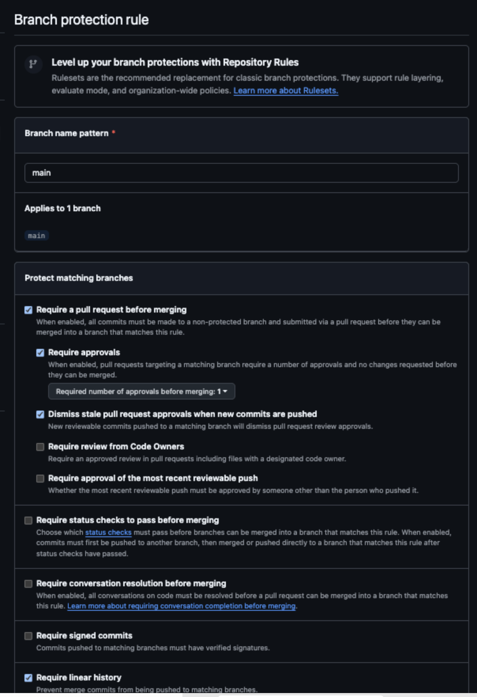
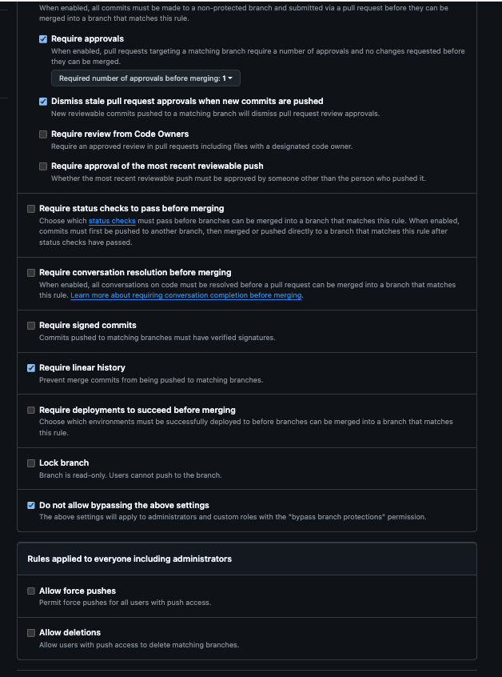
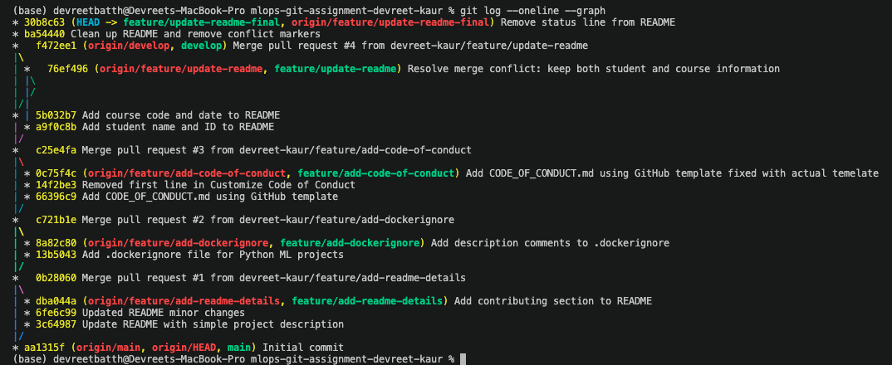
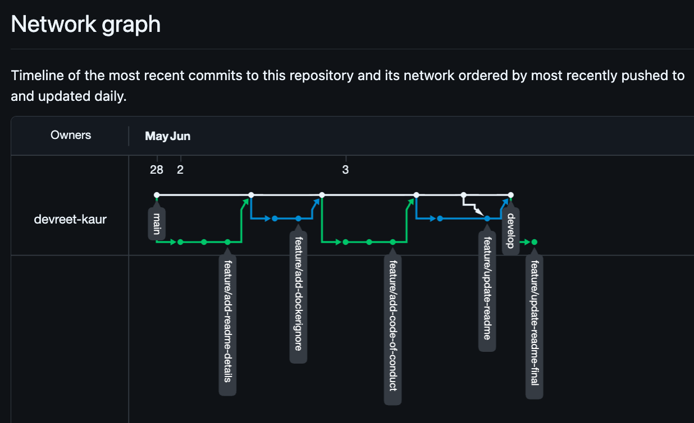

# Assignment 1 Report: Git Branching & Collaboration

**Student Name:** Devreet Kaur  
**Student ID:** 139459259  
**Course:** MAI201 : ML Ops 
**Term:** Summer 2026  

**Repository:** https://github.com/devreet-kaur/mlops-git-assignment-devreet-kaur

---
## Part 1: Repository Setup

Created a public GitHub repository named `mlops-git-assignment-devreet-kaur`, initialized with a README.md, Python .gitignore, and Apache 2.0 License. Configured Git with name and Seneca email, then cloned the repository locally.

```bash
git config --global user.name "devreet-kaur"
git config --global user.email "dkdevreet-kaur@myseneca.ca"
git clone https://github.com/devreet-kaur/mlops-git-assignment-devreet-kaur.git
cd mlops-git-assignment-devreet-kaur
```

Created a `develop` branch from main and pushed it to remote:

```bash
git checkout -b develop
git push -u origin develop
```

Set `develop` as the default branch in GitHub Settings so all pull requests target develop instead of main.

---

## Part 2: Feature Branches

### feature/add-readme-details

Branched from develop after pulling latest changes. Added project description, setup instructions, prerequisites, and a contributing section to README.md.

```bash
git checkout develop
git pull origin develop
git checkout -b feature/add-readme-details
```

Commits:
- `Update README with simple project description`
- `Updated README minor changes`
- `Add contributing section to README`

Merged to develop via Pull Request #1.

### feature/add-dockerignore

Branched from develop. Created a `.dockerignore` file with exclusions for Python cache files, virtual environments, data files, trained models, MLflow outputs, Jupyter checkpoints, and IDE files.

```bash
git checkout develop
git pull origin develop
git checkout -b feature/add-dockerignore
```

Commits:
- `Add .dockerignore file for Python ML projects`
- `Add description comments to .dockerignore`

Merged to develop via Pull Request #2.

### feature/add-code-of-conduct

Branched from develop. Added `CODE_OF_CONDUCT.md` using the official GitHub Contributor Covenant template.

```bash
git checkout develop
git pull origin develop
git checkout -b feature/add-code-of-conduct
```

Commits:
- `Add CODE_OF_CONDUCT.md using GitHub template`
- `Removed first line in Customize Code of Conduct`
- `Add CODE_OF_CONDUCT.md using GitHub template fixed with actual template`

Merged to develop via Pull Request #3.

---

## Part 3: Merge Conflict Resolution

Created `feature/update-readme` from develop and added student name and student ID to README.md:

```bash
git checkout develop
git pull origin develop
git checkout -b feature/update-readme
git add README.md
git commit -m "Add student name and ID to README"
git push -u origin feature/update-readme
```

Switched back to develop and added course code and date to the same section, creating a conflict:

```bash
git checkout develop
git add README.md
git commit -m "Add course code and date to README"
git push origin develop
```

Opened a pull request from `feature/update-readme` to develop. GitHub showed:

> "This branch has conflicts that can't be automatically merged"

 
Resolved the conflict locally:

```bash
git fetch origin
git checkout feature/update-readme
git merge origin/develop
```

Git output:
```
CONFLICT (content): Merge conflict in README.md
Automatic merge failed; fix conflicts and then commit the result.
```


Opened README.md in VS Code, removed all conflict markers (`<<<<<<<`, `=======`, `>>>>>>>`), and kept both the student information and course information sections. Committed and pushed the resolution:

```bash
git add README.md
git commit -m "Resolve merge conflict: keep both student and course information"
git push origin feature/update-readme
```

Merged via Pull Request #4.

---

## Part 4: Branch Protection Rules

Configured classic branch protection rules for `main` via Settings → Branches → Add classic branch protection rule.

**Branch name pattern:** `main` (applies to 1 branch)

Rules configured:
- Require a pull request before merging
- Require approvals (minimum 1)
- Dismiss stale pull request approvals when new commits are pushed
- Require linear history
- Do not allow bypassing the above settings
- Allow force pushes: disabled
- Allow deletions: disabled

### Screenshot: Branch Protection Rules




---

## Part 5: Git Log

```
* 30b8c63 (HEAD -> feature/update-readme-final, origin/feature/update-readme-final) Remove status line from README
* ba54440 Clean up README and remove conflict markers
*   f472ee1 (origin/develop, develop) Merge pull request #4 from devreet-kaur/feature/update-readme
|\  
| *   76ef496 (origin/feature/update-readme, feature/update-readme) Resolve merge conflict: keep both student and course information
| |\  
| |/  
|/|   
* | 5b032b7 Add course code and date to README
| * a9f0c8b Add student name and ID to README
|/  
*   c25e4fa Merge pull request #3 from devreet-kaur/feature/add-code-of-conduct
|\  
| * 0c75f4c (origin/feature/add-code-of-conduct, feature/add-code-of-conduct) Add CODE_OF_CONDUCT.md using GitHub template fixed with actual temelate
| * 14f2be3 Removed first line in Customize Code of Conduct
| * 66396c9 Add CODE_OF_CONDUCT.md using GitHub template
|/  
*   c721b1e Merge pull request #2 from devreet-kaur/feature/add-dockerignore
|\  
| * 8a82c80 (origin/feature/add-dockerignore, feature/add-dockerignore) Add description comments to .dockerignore
| * 13b5043 Add .dockerignore file for Python ML projects
|/  
*   0b28060 Merge pull request #1 from devreet-kaur/feature/add-readme-details
|\  
| * dba044a (origin/feature/add-readme-details, feature/add-readme-details) Add contributing section to README
| * 6fe6c99 Updated README minor changes
| * 3c64987 Update README with simple project description
|/  
* aa1315f (origin/main, origin/HEAD, main) Initial commit
```
### Screenshot: Git Log


---
### Screenshot: GitHub Network Graph


---

## Reflection

### Challenges

The main challenge with resolving merge conflicts was making sure I was on the correct branch before starting. Switching between branches during the conflict process made it easy to lose track of where changes were coming from. Checking `git branch` before every operation helped avoid committing to the wrong branch.

The second challenge was deciding which code to keep when the conflict markers appeared. With two conflicting sections in the same file, it was not always obvious which version was from which branch. Reading the markers carefully (`HEAD` means current branch, the hash after `>>>>>>>` means the incoming branch) made it clear which changes belonged where. Keeping both sections rather than choosing one was the correct resolution for this assignment.

A third issue was discovering conflict markers left behind in README.md after the merge was already complete. Running `git diff` caught this before it caused problems in the next PR.

### Key Takeaways

Always verify the current branch with `git branch` before making any commit. Pull develop before creating any feature branch to start from the latest code. Use `git log --oneline origin/develop..HEAD` to confirm how many commits are staged before pushing. Small, focused commits with clear messages make conflict resolution faster because each change has a clear purpose.


